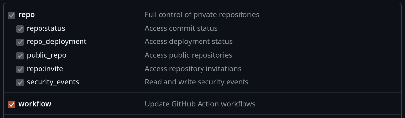
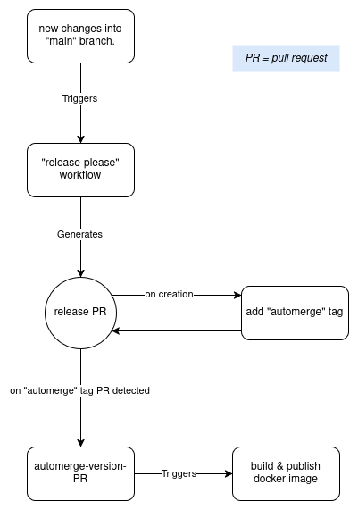

# Semantic versioning demo
This demo repository shows how semantic versioning can be applied to Docker image builds to ensure they always have the correct version number. This repository uses the *"release-please"* action from GitHub actions to achieve the generation of version numbers based on commit messages.

This approach could also be used to manage the application version across the entire repository. For example to update the version number in the `package.json` file for Node.js projects. It will also automatically create releases and generate a `CHANGELOG.md` file that has a summary of all changes.

## How to use
To use this approach of versioning docker images, there are a couple of things needed to get started:
1. A (classic) Personal access token with the scopes: `repo - all`, `workflow - all`.

2. All commit messages that should be tracked, should use the _"Conventional Commits"_ specification. This can be found [HERE](https://www.conventionalcommits.org/en/v1.0.0/).
3. A docker account to upload the created images to. The credentials are required for the workflow to be able to build and publish the images. 

Not much more is needed to use this approach of semantic versioning, however it might not always be prefered to follow the *"Converntional Commits"*
guidelines. 

To actually start using the workflow correctly, the developer is expected to have the following workflow:
1. New changes are made in branch "x".
2. The changes are committed using the *"Converntional Commits"* specifications.
3. Next up, the changes are merged into the `main` branch using a pull request, the developers should merge this pull request themselves. 
4. After the pull request was successfully merged into main, the workflow will start. After some time it will create it's own new pull request, **DO NOT TOUCH THIS PULL REQUEST!**
5. The workflow will automatically merge the new pull request to make sure all version history is updated and a new release is published.

The main reason a second pull request is made, is because the *"release-please"* workflow needs to update the `CHANGELOG.md` file to keep track of the version history. These changes need to be merged into the main codebase before they can be tracked, and thus a pull request is needed. 

## How it works
This semantic versioning demo uses GitHub workflows to analyse the commit messages on the main branch. Based on these commit messages it will determine what kind of updates the application has had, and thus what it's version number should be. All updates and versions are logged in the `CHANGELOG.md` file to make sure an up-to-date overview off all changes is visible. 

The following small diagram aims to make it a little bit easier to visualise the process of the semantic versioning system.

